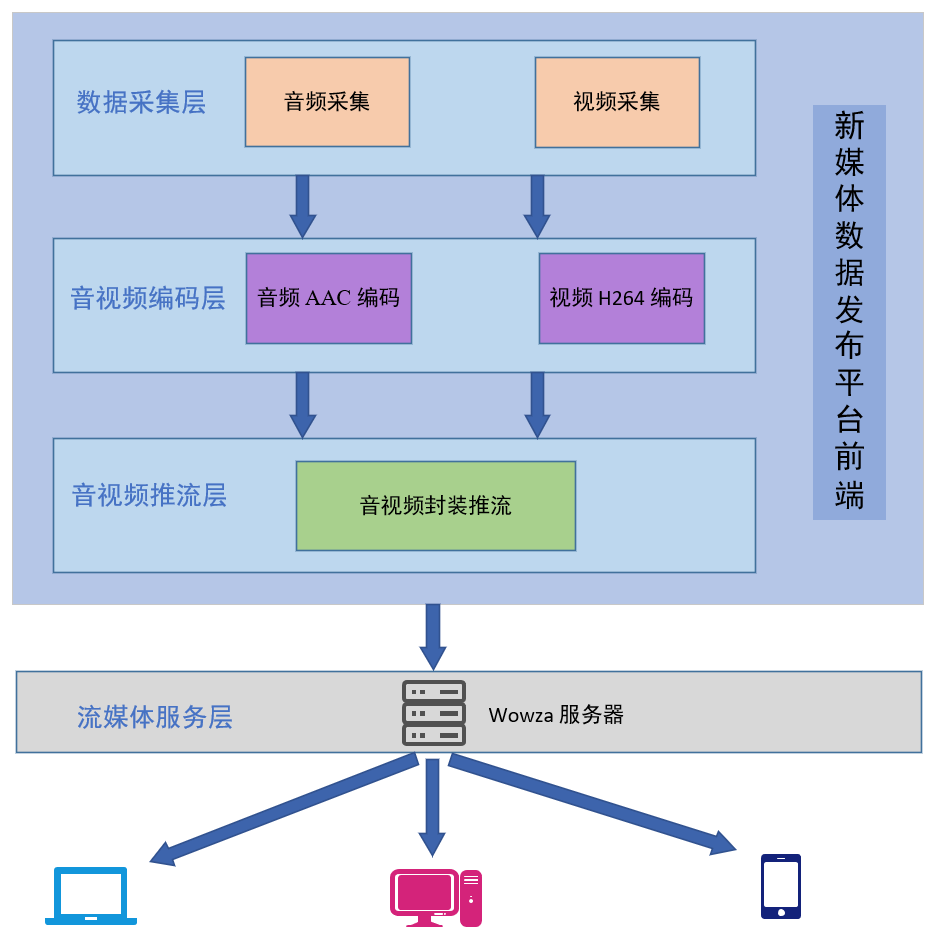

# cource3_live_platform
电子科技大学信软学院 综合课程设计3
# 概述
因为时间原因，该项目并非我们小组完全开发完成，该项目是上一届学长留下的，我们拿下来改了一些，理解并修改小部分代码后完成了答辩。该代码目前只是实现了windows上的音视频采集与推流，功能有限，仅供参考。项目总体架构图如下：

# 题目
设计一个直播平台，实现客户端推流、流媒体服务器。主要任务点：
+ 了解AAC压缩编码原理，选用合适的开发工具和平台。
+ 了解Windows核心编程和音频采集原理，通过板载声卡Line采集音频信号，并进行16bit量化。
+ 实时计算音频流的相位和电平并在界面显示和报警。
+ 了解RTMP协议封装原理，将实时音频流推送到流媒体或阿里云进行发布
+ 通过已有播放器完成源音频的播放试验。
+ 完成团队合作与分工。

# 实现的功能
+ 本地windows音视频采集
+ AAC音频编码与H.264视频编码
+ RTMP推流
+ Wowza 流媒体服务器

# 其他

`wowza`服务器需要自己在本地搭建，比较简单。但是要让这个程序run起来可能不是一件容易的事情，反正我是花了很久的时间。但是一定是能够跑起来的，千万不要放弃。

# IDE或工具
+ VS Studio 2019
+ OBS Studio(推流软件，测试用)
+ VLC播放器（拉流用）
+ Qt Creator

## 环境依赖
+ Qt 5.13 (记得安装社区开源版本)，
+ ffmpeg 下载编译好的三个包 [zeranoe](https://ffmpeg.zeranoe.com/builds/)
+ opencv 3.2.0
## 声明 
要是原作者看到了这个项目，如果不满意的话请联系我。